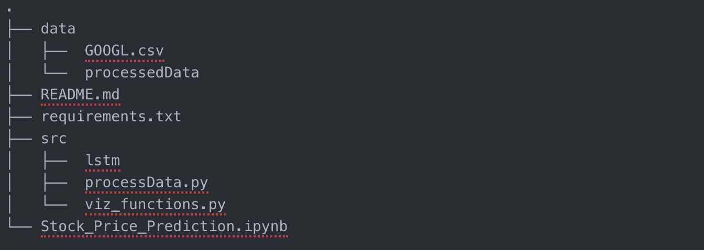

# Predict Stock Prices

This repository contains code and associated files for deploying a stock price predictor using AWS SageMaker.

## Project Overview

In this project, the aim is to build a stock price predictor that examines the historic stock dataset for a publicly listed company and performs learning of various factors that affect the stock and allows prediction of future stock closing values. Predicting time-dependent data, referred to as time-series forecasting, is an active area of research; the task is non-trivial as many factors involved in the prediction: physical factors vs. physhological, rational and irrational behaviour, etc., make share prices volatile and very difficult to predict with a high degree of accuracy.

## Project Structure

 * `Stock_Price_Prediction.ipynb` The main notebook for this project that is intended to be executed in Amazon SageMaker.
 * `data` directory where the initial dataset is stored.
 * `processedData` sub directory of `data` where the modified and normalized dataset is stored for reusability.
 * `src` additional scripts for helper functions are stored in this directory.
 * `lstm` sub directory of `src` where the model definition of LSTM model is encoded.
 * `requirements.txt` External packages/libraries needed for this code are listed here and installed using `pip`
